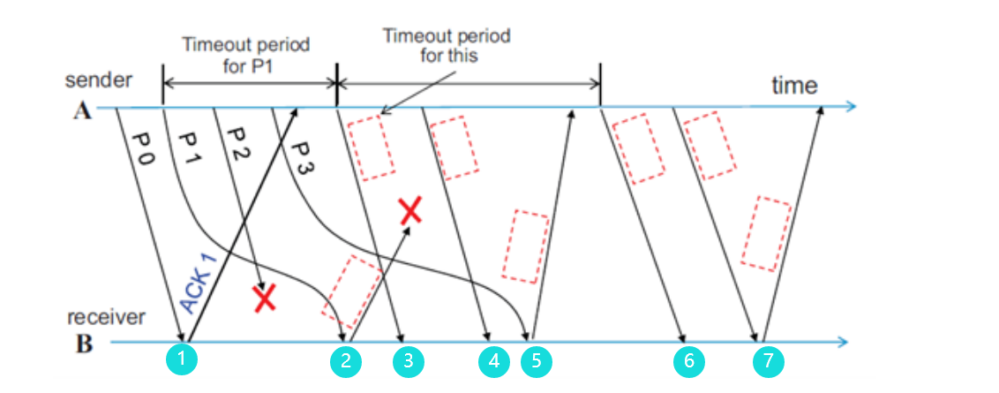

## Q1


1. so we get the following answers:
   1. * ACK 2
   2. P1
   3. P2
   4. * NAK 2
   5. * P2
   6. * P3
   7. * ACK4

2. 



so we get the following answers:

1. A
2. * A
3. * DD
4. * DE
5. * DE
6. A
7. A

## Q2

1. CSMA/CA过程如下
   1. 首先发送节点在发送前监听信道。如果有人正在使用信道，则随机等待一段时间再监听（随机时间是为了降低再次冲突可能）
   2. 在发出数据前，先发一段RTS给目标端，等目标端发出CTS。（避免其他节点碰撞）
   3. 在发送端和目标端都接收到封包后，开始传输
2. 因为在无线局域网中，设备在发送包的时候很难确认通信节点是否有冲突，因此不能用CSMA/CD，只能用CSMA/CA
3. 是用于解决隐藏节点的问题。为了防止两个节点AC都能听到接入点B，但他们无法听到彼此导致同时向B发出信息帧会冲突的问题。使用RTS-CTS机制可以确保某个信道会被预留给一个节点一小段时间
4. 根据如下规则进行自学习：
   1. 如果源LAN与目标LAN一致，丢弃包，这个包不需要传输
   2. 如果不一致，记录来源站与端口：既然包是从A站该端口传入，那么该端口传出的包会回到A站。在转发过程中逐渐建立端口与源地址的关系，从而建立转发表。为了避免包在网络中循环转发，采用了生成树算法。
5. switch/bridge 和hub之间有如下区别：
   1. Hub是物理层的，switch是连接层的
   2. switch可以识别mac地址，智能向指定端口传播，但hub只能广播到所有端口
   3. Hub可能有广播风暴，但switch可以避免广播风暴


## Q3

1. because the number behind the slash is 26, so the bit left is 32-26=6bits. Therefore, only $$2^6=64$$network can be classified. However, 192.168.8.0 and 192.168.8.1 should not be set as IP address, so we only have 64-2=62 IP address.
2. three types are as below:
   1. Unicast Address, such as 192.168.8.10
   2. Multicast Address, such as 192.168.8.1
   3. Broadcast Address, such as 192.168.8.63

3. ARP Request means sender broadcast a package, which include sender's ip address,sender's MAC address and receiver's ip address. Only the receiver whose ip address is exactly the ip address the package write will reply. ARP reply means the receiver send the package back to the sender, tell the sender its ip address and MAC address

## Q4

1. code is as below:

```python
Dijkstra(edgelist,pointlist,source):
    N = {source},initialize all D(v)= infinity
    for node in pointlist:
        for stnode in N:
            D(node) = min{D(node),D(stnode)+edgelength(stnode,node)};
            if D(node)== D(stnode)+edgelength(stnode,node):
                curnodelist.append(node)
 N.append(the node who has minimum length of D(stnode)+edgelength(stnode,node) and not in N)
```

2. step is as below:

| step | Set N     | D(B),p(B) | D(C),p(C) | D(D),p(D) | D(E),p(E) | D(F),p(F) |
| ---- | --------- | --------- | --------- | --------- | --------- | --------- |
| 1    | A         | 4,A       | 1,A       | none      | none      | none      |
| 2    | A,C       | 3,C       | 1,A       | none      | 4,C       | none      |
| 3    | A,C,B     | 3,C       | 1,A       | 9,B       | 4,C       | 13,F      |
| 4    | A,C,B,E   | 3,C       | 1,A       | 5,E       | 4,C       | 7,E       |
| 5    | A,C,B,E,D | 3,C       | 1,A       | 5,E       | 4,C       | 6,E       |

3. No, because when we consider BER, of the whole path, we should multiple each individual route among the whole path. However, we can modify the Dijtstra a little to fit the problem solving.  First, we define that every path's score of the graph is 1-BER.  Then ,instead calculate the minimum of D(v)+l(v,w),D(w), we should find the maximum score of D(v)*l(v,w) and D(w). When we try to add node in Set N we should do so too. Then we can solve this problem by Dijkstra again.

## Q5

| step | A    | B    | C    | D    | E    |
| ---- | ---- | ---- | ---- | ---- | ---- |
| 1    | 0    | inf  | inf  | inf  | inf  |
| 2    | 0    | 4    | 1    | inf  | inf  |
| 3    | 0    | 3    | 1    | 9    | 4    |
| 4    | 0    | 3    | 1    | 5    | 4    |
| 5    | 0    | 3    | 1    | 5    | 4    |

Because the longest path is node-1=5 route, so we only need to update 5 time to get the best answer.

## Q6

1. 排队买票
2. 排队买票，但是存在VIP，VIP可以优先买票
3. 多线程计算机的作业管理
4. 网络带宽分配