(Because some unexpected error of Typora, I have to set the image a bit smaller so that it won't get over 10 pages. Please understand if this causes you reading inconvenience.)

### Q1

1. according to the png below, I can get that my ip address is 100.78.233.230, 

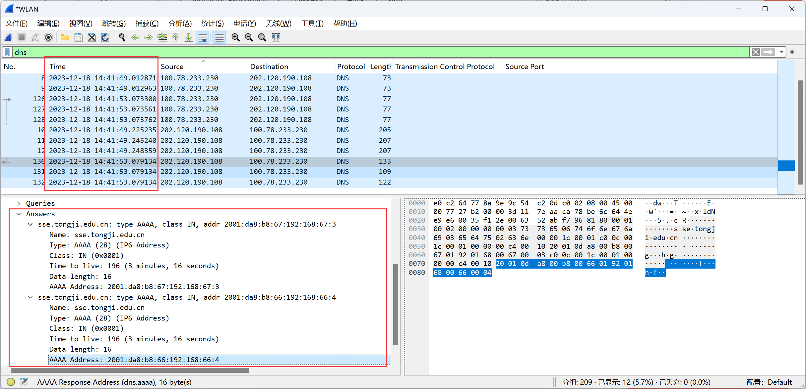

then I check the network flow, and find 2001:da8:b8:66:192:168:67:3 is the website's addr:

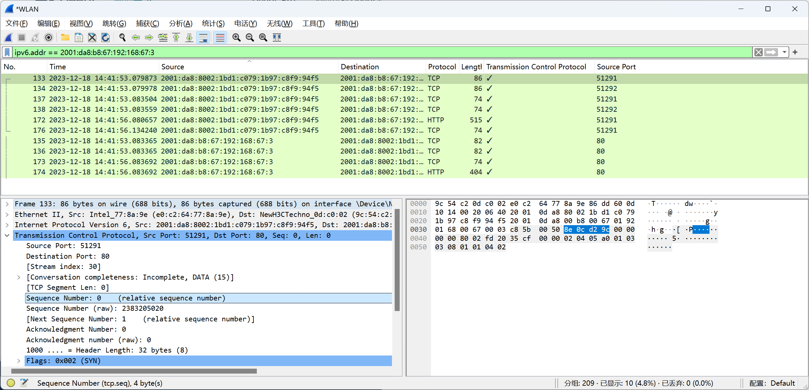

2. I open one qq dialog box, and find the connection: one connection is with qzone,the other is with the gamecenter of qq（you can see it in the Answers part).the filter is as below(I find the ip address of it)

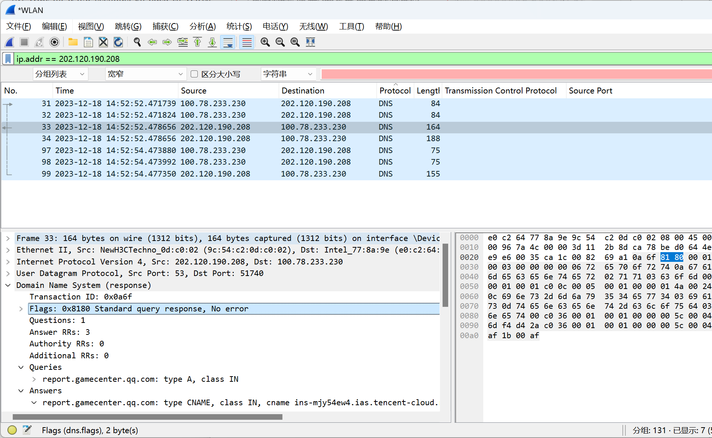

And I got a connection of feishu. The result is as below:

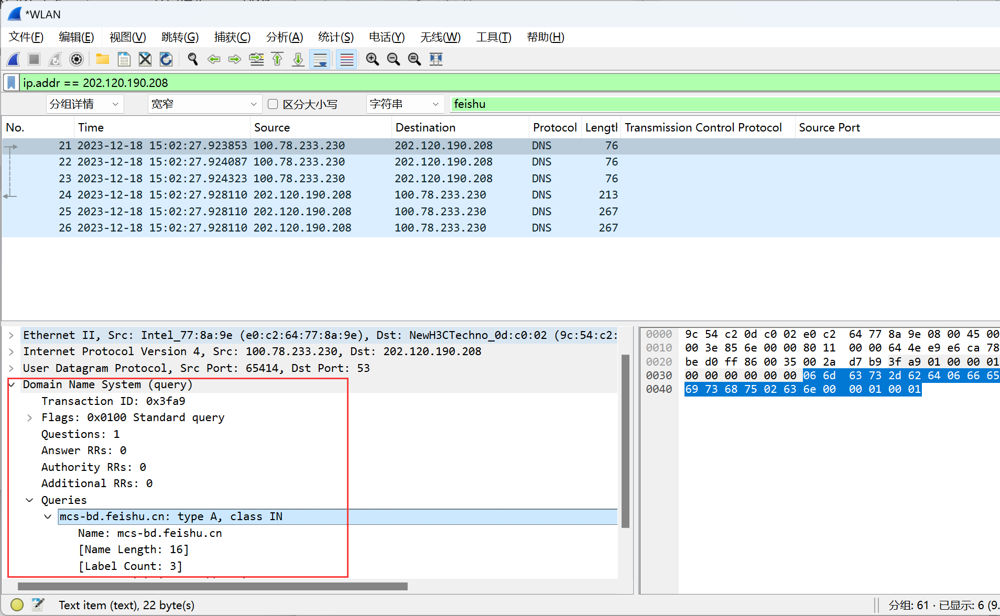

### 2.1

a.  result is as below:

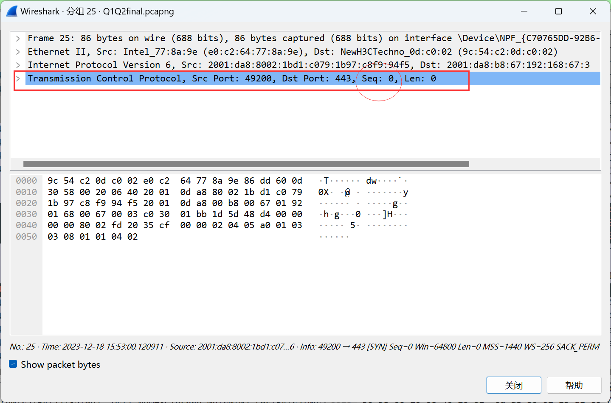

So the sequence number is 0(or the random number)

b. the flag set it as a SYN segment,you can see it in wireshark view window.

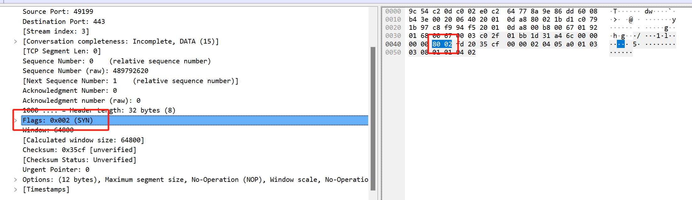

### 2.2

(because I run the program some times, so the raw number may be quite different to 2.1)

we can see everything from the picture below.

a. so the sequence number is 0

b. so the value of Ack field is 1.

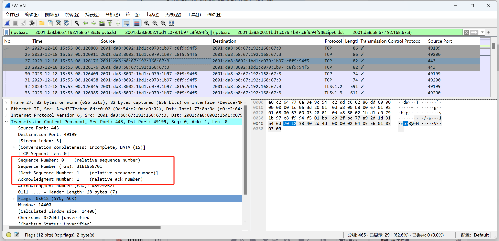

c. Acknowledgement number is the sequence number website get +1(you can see it below,that is the sequence number)

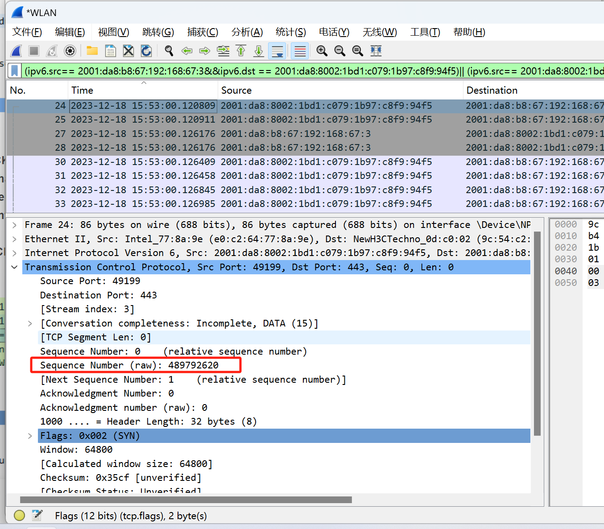

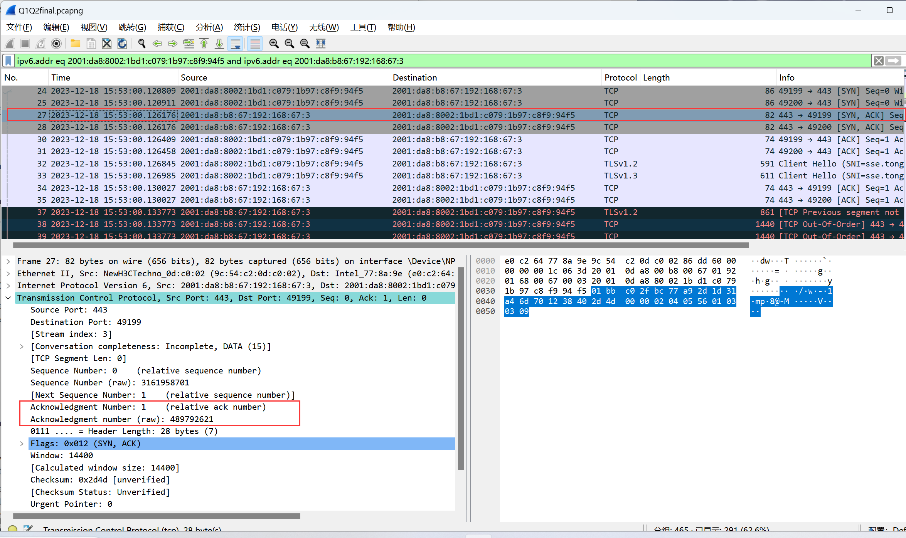

d. the flags part identifies the segment

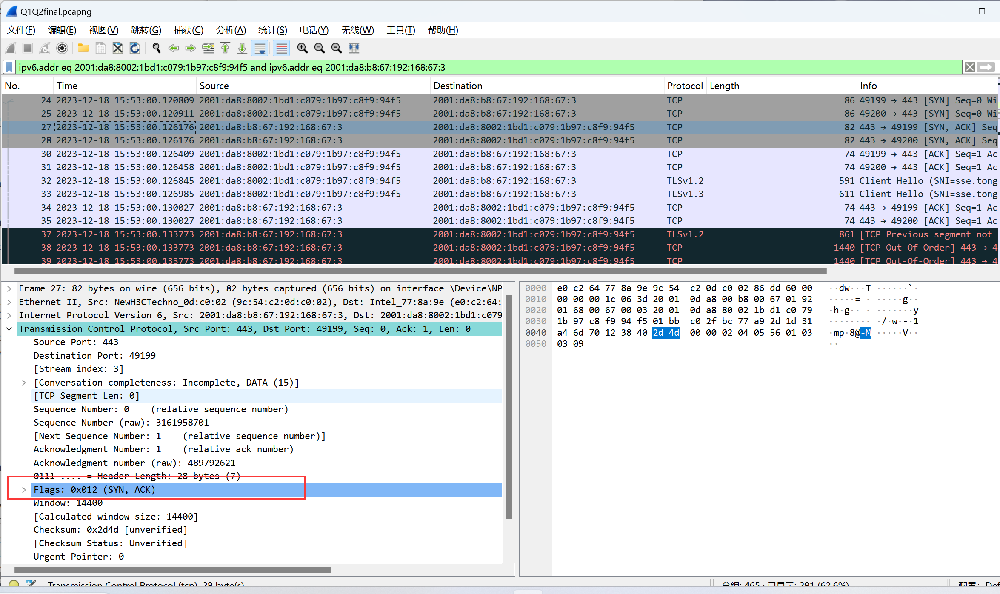

### 2.3 

Because 2 handshake may cause unsafe behaviour. If you only use 2 hand shake, assume that client send a SYN signal, but the signal send so slow that client thinks it is timeout. So the client send another SYN signal to build a tcp connection with server. However, the signal client sent before reach the server, and because now tcp only have 2 hand shakes, the server will build another tcp connection with client due to this slow signal. However, client consider it is a time out signal so it won't send anything in this route. Therefore, this route is created but never used, which should not occur. So tcp needs at least 3 hand shake.

### 2.4

Now I will select the first section

a. according to the timestamp showed below, it was sent in 2023-06-30 14:29:20.844633

b. this package is the ack of the first section and the second section. I check it by finding that add seq number of section 1 and section 2 up can get the ack number of this package.

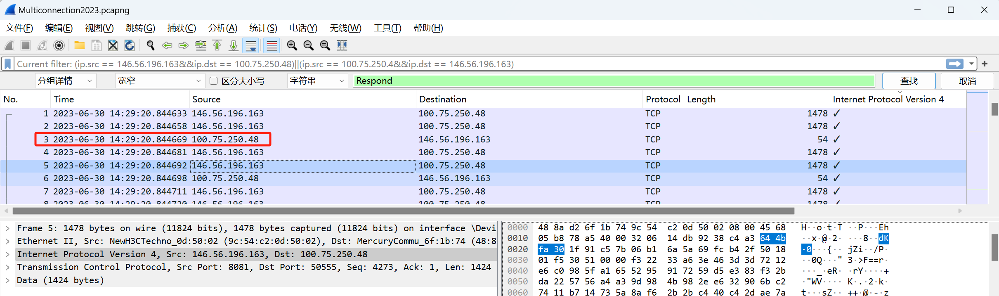

so the time is 2023-06-30 14:29:20.844669

c. result is as below:

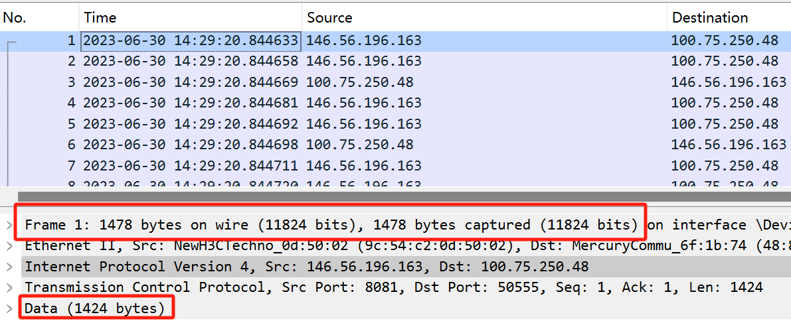

So the Data is 1424 bytes.

d. 

it is really hard to find the first package from so many packages. I have to make the picture so big that in this part the RTT become a line.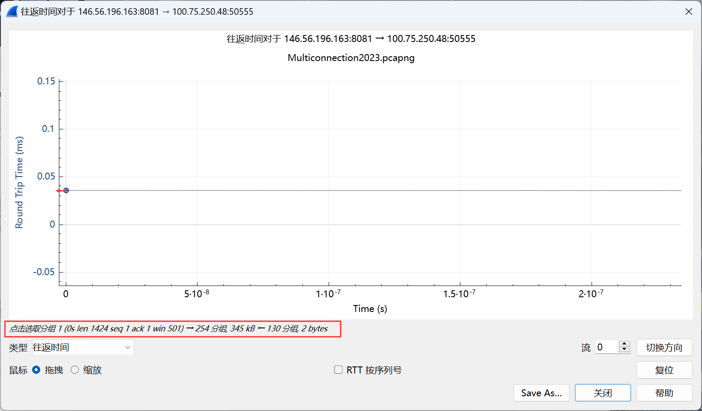

So you can see that the RTT of first package is about 0.036ms, and according to the graph below, we can also calculate the RTT time by calculate the time spend between No.1 section and No.3 section using the exact timestamp.

844669-844633=36, so it is $$3.6\times10^{-5}$$s.

### 2.5

a. 

the concept is that: in Tcp connection, sending and receiving are two separate parts.(That's why we need 3 hand shakes and 4 hand waves, because we need to start and stop two separately connection). Therefore, it is obvious that the two plots are different because they represent the info of sending packages from client and server seperately.  And that's why the plots are different--The parameters of the transmission (e.g. sending window, sending rate) are affected by the settings of the server and client themselves.

b.

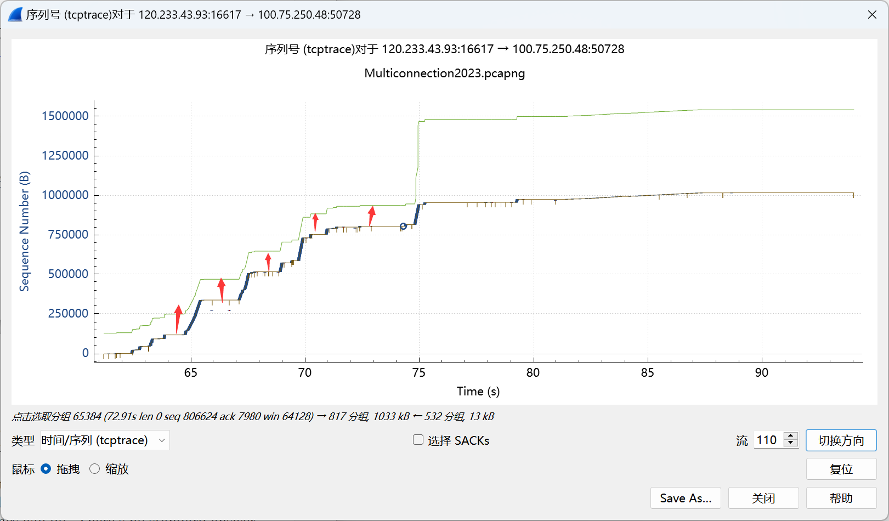

Yes.  We can see that the sending rate is increase when the window's buffer increase. And from the picture we find that when the window is quite small, the sender stop sending new package. And when the window getting larger, the sender start to send packages again. So we can assume that the buffer space throttle the sender.

c.  

Multiple congestion occurs during transmission. As you can see from the graph, the throughput varies greatly. Each drop in throughput can be seen as a very severe congestion. And in some of the drops the throughput has almost gone to zero, which shows the severity of the congestion.

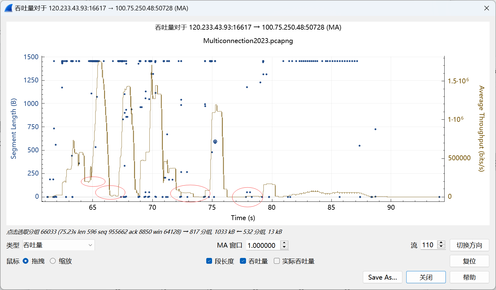

d.

1. the possible method when TCP detect retransmit signal

   1. the receiver's scale of window size will get larger. From the picture below, we can see when congestion occur, the receiver will set it's window larger and larger. By this way, it can avoid the retransmisson the reason of which is package loss due to too small of window.

   2. the sender will stop sending package so fast by using some cwnd algorithm. We can see from the following picture: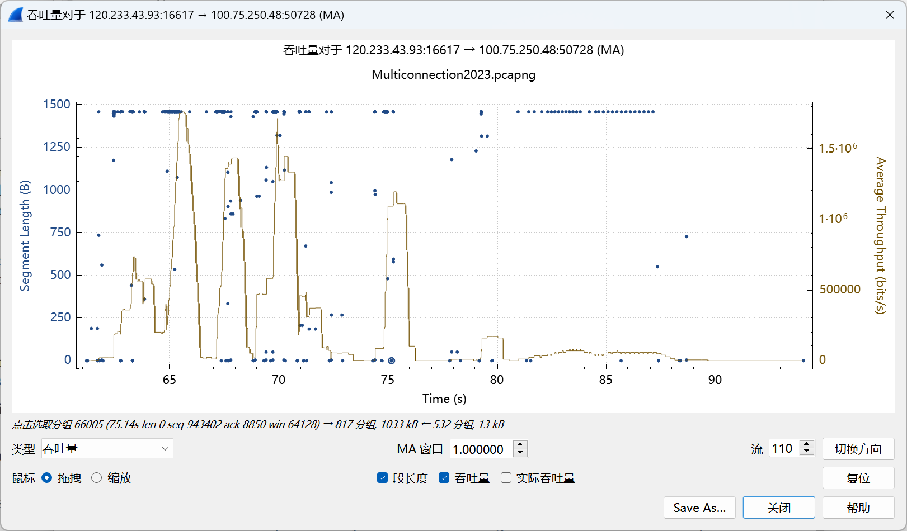

      So when sender detect the Tcp need to retransmisson, it will assume that the channel is overcrowding, and it will sending less package to avoid making the channel more crowded again.

   3. When a retransmission occurs, TCP resets the sequence number to the sequence of the lost packet, ensuring that the packet's information is not misplaced.

2. some method to avoid transmisson failure

   1. An unstable network connection can lead to a large network RTT and thus transmission timeouts, so a good network connection can reduce retransmissions
   2. The TCP window controls how much data the sender can send, and if the window is too small, it can restrict the flow of data and may result in a decrease in effective transmission speed. Therefore, a suitable window adjustment algorithm is needed to adapt to the appropriate transmission rate
   3. Too many packets in the network exceed the carrying capacity of the network, resulting in delayed or lost packets. Therefore, Internet access devices need good congestion control protocols to maximize the use of current bandwidth while allowing fair use of network bandwidth.
   4. Incorrect firewall configurations can lead to transmission failures, so the application layer needs to be set up with a sensible firewall protocol

### 2.6

First, we select a small section of time. It would be better if in this section of time the connection is stable. Then we sum the amount of data sent during this section of time. Then we could estimate the throughput of the TCP by using the formula R = B/T,that is, throughput equals to the data you sent during the section of time divide the length of the section of time. In this experiment, you can select a segment of consecutive TCP packets and then calculate the amount of data they transmit versus calculating the time interval between the first and last packet to estimate throughput

### 2.7

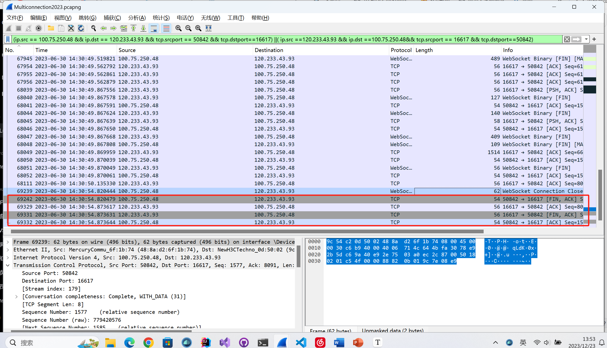

These four packages represent the termination of TCP connection. You can see the package info in the "info" column. First,100.75.250.48 send a signal package whose flag is "FIN,ACK"(it equals to the first step of TCP termination: sending a FIN package). Then 120.233.43.93 send an ACK package to tell 100.75.250.48 it received the FIN signal and stop getting message from 100.75.250.48.

Then 120.233.43.93 send a "FIN,ACK"package to tell the 100.75.250.48 it will stop sending message. And then 100.75.250.48 send the ACK package to tell 120.233.43.93 it stop getting message from 120.233.43.93. Finally, the TCP connection terminate.

### 2.8

Yes, it's possible to make a "four-wave" protocol a "three-wave" protocol. You can combine the first ACK and second FIN signals into a single packet for sending. However, due to the timeout mechanism, if the passive shutdown party (the party transmitting the second FIN signal) has a large amount of data that has not yet been transmitted to the active shutdown party, it will take longer to send the ACK and FIN signal packets, which will result in the active shutdown party potentially sending the FIN signal multiple times.

### 2.9

This project help me to understand TCP better. However, the begin of the project is such an awful experiment. I spend the whole afternoon to find out the sse.tongji.edu.cn ip address by checking so much data captured by wireshark. And finally I found that it is ipv6 address and I should shut my vpn down. The dynamic ip address in school network due to some reason I don't know is an another annoying problem. I think it would be better to give some tutorials link about the wireshark to help us build a concept of how to use this tool to find package, and www.baidu.com may be a more suitable example because I am more familiar with ipv4 address.

Also I find that the language problem is another big difficulty. Sometimes I'm not sure if I have correctly understood what the question want me to do. The 2.5 a is the example. I felt so confused for several day to try to find out what the question want me to do.